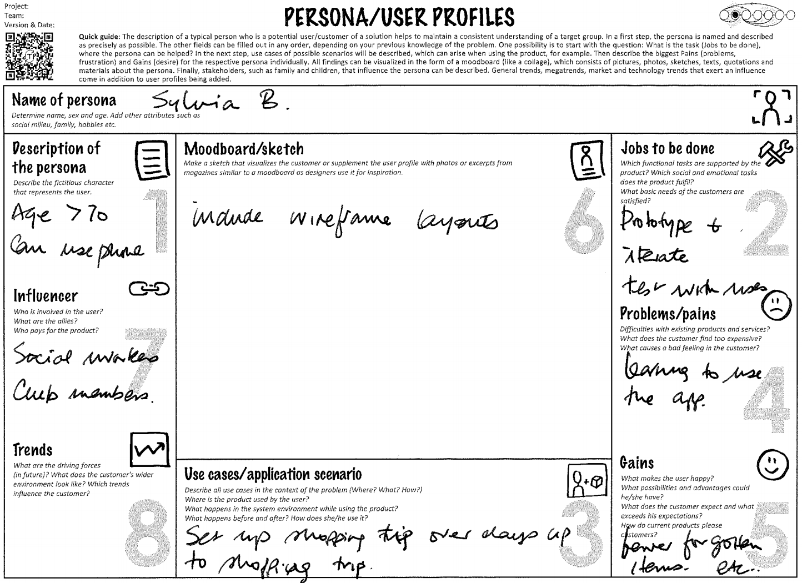

# Design Thinking

## Concepts

The examples below indicate the scope of each analysis tool. They can be implemented as a table, rather than as the graphic shown below.&#x20;

Look at the main document content for the table parameters.

### Problem Statement

<figure><figcaption></figcaption></figure>

### Persona

<figure><figcaption></figcaption></figure>

### Empathy Map

<figure><figcaption></figcaption></figure>

